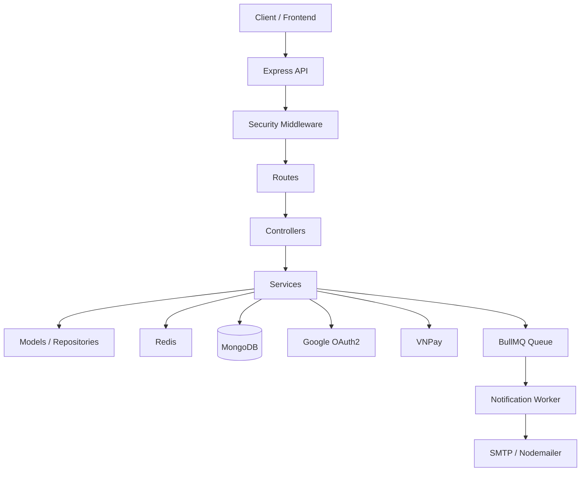
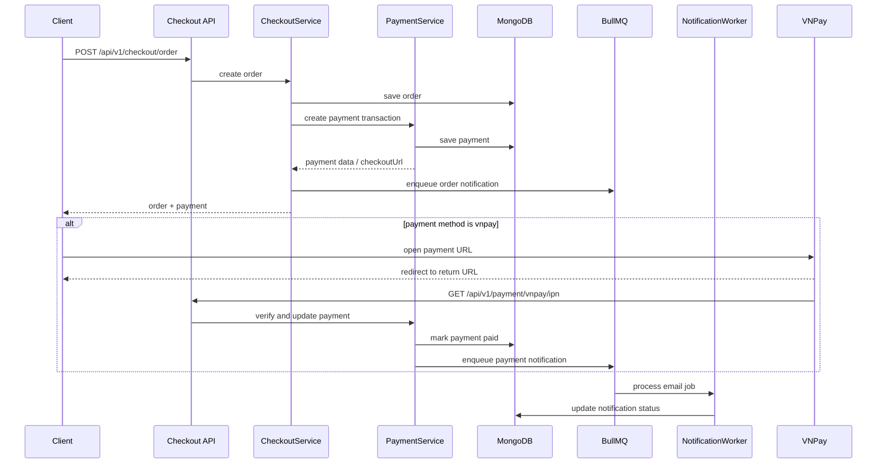

# Ecommerce Backend API

Backend API for an ecommerce platform built with Node.js, Express, MongoDB, Redis, BullMQ, Google OAuth2, and VNPay.

- JWT auth with refresh token rotation
- API key + permission middleware
- OTP-based forgot-password flow
- product, cart, discount, checkout, comment modules
- idempotent order creation
- payment transaction layer
- VNPay integration
- notification system with BullMQ worker
- Swagger docs, unit tests, Docker, and CI

## Demo Highlights

- Authentication:
  local signup/login, Google OAuth2 login, refresh token, logout, logout all devices
- Security:
  API key middleware, permission middleware, login fail counter, OTP verification guard, rate limiting
- Commerce:
  product listing, cart mutation, discount calculation, checkout review, order creation, order status transitions
- Payments:
  payment transaction record per order, mock payment flow, VNPay payment URL creation, VNPay return/IPN handling
- Notifications:
  notification record in MongoDB, BullMQ email queue, worker-based email delivery

## Tech Stack

| Layer | Technology |
| --- | --- |
| Runtime | Node.js 20 |
| Framework | Express 5 |
| Database | MongoDB + Mongoose |
| Cache / Queue | Redis + BullMQ |
| Authentication | JWT + Google OAuth2 |
| Payments | VNPay |
| Email | Nodemailer |
| Testing | Jest |
| API Docs | Swagger UI |
| Deployment | Docker, Docker Compose, GitHub Actions |

## Architecture

```text
Client
  |
  v
Express App
  |
  +-- Global middleware
  |     - morgan
  |     - helmet
  |     - compression
  |     - API key
  |     - permission
  |     - global rate limit
  |
  +-- Routes
  |     - auth
  |     - product
  |     - cart
  |     - discount
  |     - checkout
  |     - payment
  |     - notification
  |     - comment
  |
  +-- Controllers
  |
  +-- Services
  |     - business logic
  |     - payment orchestration
  |     - notification creation
  |
  +-- Models / Repositories
  |
  +-- External systems
        - MongoDB
        - Redis
        - BullMQ worker
        - Google OAuth2
        - VNPay
        - SMTP
```



## Main Flows

### 1. Authentication Flow

```text
Client -> /api/v1/auth/login
       -> AccessController
       -> AccessService
       -> User / Shop lookup
       -> bcrypt password check
       -> access token + refresh token
       -> save refresh token
       -> JSON response
```

### 2. Google OAuth2 Flow

```text
Client -> /api/v1/auth/google/authorization-url
       -> redirect user to Google
       -> Google returns code + state
       -> /api/v1/auth/google/callback
       -> exchange code for token
       -> fetch Google profile
       -> create or link local user
       -> issue local JWT tokens
```

### 3. Checkout Flow

```text
Client -> /api/v1/checkout/order
       -> validate cart
       -> recalculate price and discount on server
       -> reserve inventory
       -> create order
       -> create payment transaction
       -> emit notification event
       -> clear cart
       -> JSON response
```

### 4. Payment Flow

#### COD

```text
Order created
-> payment transaction stored with provider = internal
-> payment status = pending
```

#### VNPay

```text
Order created
-> payment transaction stored with provider = vnpay
-> backend builds signed VNPay payment URL
-> client redirects to VNPay
-> VNPay returns browser to return URL
-> VNPay calls IPN URL
-> backend verifies signature
-> backend marks payment as paid/failed
-> backend updates order payment snapshot
-> backend emits payment notification
```



### 5. Notification Flow

```text
Business event
-> NotificationService creates notification record in MongoDB
-> enqueue email job in BullMQ
-> Notification Worker consumes job
-> send email via Nodemailer
-> update delivery status
```

## Project Structure

```text
app.js
server.js

auth/
configs/
controllers/
docs/
helpers/
models/
queues/
routes/
services/
tests/
utils/
workers/
```

## API Base Paths

- Health: `/health`
- Liveness: `/`
- API root: `/api/v1`
- Swagger UI: `/api-docs`
- OpenAPI JSON: `/api-docs.json`

Main route groups:

- `/auth`
- `/product`
- `/discount`
- `/cart`
- `/checkout`
- `/payment`
- `/notification`
- `/comment`

## Key Endpoints

### Auth

- `POST /api/v1/auth/signup`
- `POST /api/v1/auth/signup/shop`
- `POST /api/v1/auth/login`
- `GET /api/v1/auth/google/authorization-url`
- `GET /api/v1/auth/google/callback`
- `POST /api/v1/auth/refresh-token`
- `POST /api/v1/auth/logout`
- `POST /api/v1/auth/logout-all`

### Checkout

- `POST /api/v1/checkout/review`
- `POST /api/v1/checkout/order`
- `GET /api/v1/checkout/orders`
- `GET /api/v1/checkout/orders/:orderId`
- `POST /api/v1/checkout/orders/:orderId/cancel`
- `PATCH /api/v1/checkout/orders/:orderId/status`

### Payment

- `GET /api/v1/payment/orders/:orderId`
- `POST /api/v1/payment/orders/:orderId/confirm`
- `GET /api/v1/payment/vnpay/return`
- `GET /api/v1/payment/vnpay/ipn`

### Notification

- `GET /api/v1/notification`
- `PATCH /api/v1/notification/:notificationId/read`

## Query Support

### Product Listing

Supported on `GET /api/v1/product`:

- `page`
- `limit`
- `sortBy`
- `order`
- `search`
- `type` or `category`
- `minPrice`
- `maxPrice`
- `shopId`

### Order Listing

Supported on `GET /api/v1/checkout/orders`:

- `page`
- `limit`
- `sortBy`
- `order`
- `status`
- `minTotal`
- `maxTotal`
- `fromDate`
- `toDate`

### Comment Listing

Supported on `GET /api/v1/comment` and `GET /api/v1/comment/:productId`:

- `page`
- `limit`
- `sortBy`
- `order`
- `search`
- `userId`
- `minRating`
- `maxRating`
- `productId`

## Environment Variables

Create `.env` from `.env.example`.

```bash
cp .env.example .env
```

Important variables:

### Core

- `PORT`
- `NODE_ENV`
- `MONGODB_URL`
- `REDIS_URL`

### JWT

- `ACCESS_TOKEN_SECRET`
- `REFRESH_TOKEN_SECRET`
- `ACCESS_TOKEN_EXPIRE`
- `REFRESH_TOKEN_EXPIRE`

### Email

- `EMAIL_USER`
- `EMAIL_PASS`

### Google OAuth2

- `GOOGLE_OAUTH_CLIENT_ID`
- `GOOGLE_OAUTH_CLIENT_SECRET`
- `GOOGLE_OAUTH_REDIRECT_URI`

### VNPay

- `VNPAY_PAYMENT_URL`
- `VNPAY_TERMINAL_CODE`
- `VNPAY_HASH_SECRET`
- `VNPAY_RETURN_URL`
- `VNPAY_IPN_URL`

### Queue / Worker

- `NOTIFICATION_WORKER_ENABLED`

### Security

- `GLOBAL_API_RATE_LIMIT_MAX_REQUESTS`
- `GLOBAL_API_RATE_LIMIT_WINDOW_SECONDS`
- `LOGIN_FAIL_MAX_ATTEMPTS`
- `LOGIN_FAIL_WINDOW_SECONDS`
- `LOGIN_FAIL_BLOCK_SECONDS`
- `OTP_TTL_SECONDS`
- `OTP_MAX_ATTEMPTS`
- `OTP_VERIFY_BLOCK_SECONDS`
- `VERIFIED_TTL_SECONDS`

## Local Setup

### Requirements

- Node.js 20.x
- MongoDB
- Redis

### Install

```bash
npm ci
```

### Run development server

```bash
npm run dev
```

### Run production mode

```bash
npm start
```

### Run tests

```bash
npm test
```

## Docker

Build and start:

```bash
docker-compose up -d --build
```

Check status:

```bash
docker-compose ps
```

View logs:

```bash
docker-compose logs -f app
```

Stop:

```bash
docker-compose down
```

## Worker

The notification worker is started together with the app server in the current implementation.

Current worker responsibility:

- consume BullMQ notification email jobs
- send emails via Nodemailer
- update notification delivery status

Worker entry:

- `workers/notification.worker.js`

## Request Headers

For most `/api/v1/*` routes:

- `x-api-key: <your_api_key>`
- `Content-Type: application/json`

Protected routes also require:

- `Authorization: Bearer <access_token>`

Refresh-token flow also uses:

- `x-refresh-token: <refresh_token>`

## Testing

Current unit test coverage includes:

- login security logic
- checkout status transition rules
- rate limit middleware
- comment service ownership behavior
- notification service and worker behavior
- payment service behavior

Run tests:

```bash
npm test
```

## API Documentation

Run the app and open:

- `http://localhost:4953/api-docs`
- `http://localhost:4953/api-docs.json`

## CI / Deployment

This repository includes:

- Dockerfile
- docker-compose setup
- GitHub Actions workflow for test/build/deploy

Relevant files:

- `Dockerfile`
- `docker-compose.yml`
- `.github/workflows/deploy.yml`

## Portfolio Notes

This project is designed to demonstrate backend engineering skills beyond CRUD:

- authentication and authorization
- Redis usage for cache, limits, idempotency, and queueing
- payment transaction design
- external provider integration
- asynchronous notification processing
- testable service-layer code
- Dockerized development and deployment workflow

## Current Limitations

- test coverage is still mostly unit-level
- checkout still uses manual inventory rollback instead of Mongo transaction/session
- Google OAuth2 and VNPay require real credentials to verify end-to-end
- notification worker is currently started inside the app process, not as a separate deployable worker process
- observability is still basic

## Future Improvements

- integration tests for checkout + VNPay + notification
- separate worker process for BullMQ
- Bull Board dashboard
- refund flow for online payments
- richer metrics and monitoring
- stronger transactional consistency for checkout

## Related Docs

- Payment + Notification architecture:
  `docs/notification-payment-architecture.md`
